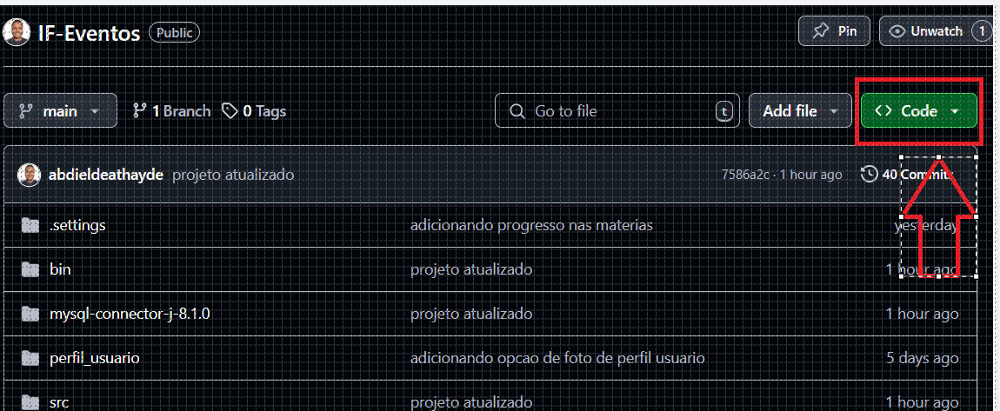
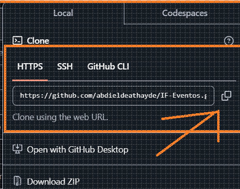
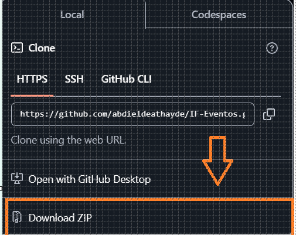

# IFSC-Eventos 

## Sistema para Eventos de Extensão do IFSC Campus Gaspar

O IFSC eventos é um aplicativo desenvolvido para cadastro de alunos e professores no aplicativo, organizar suas rotinas de estudos com um ToDo List e mostra a porcentagem de conclusões das tarefas, login, inclusão de uma imagem da preferência do aluno.

### Tecnologias utilizadas:
- Java: foi escolhida essa linguagem por ter uma forte comunidade de desenvolvedores, mostrando que é uma linguagem muito utilizada nas áreas profissional e acadêmica.
- Swing: construção de layout e componentes para desktop
- IDE Eclipse: Ferramenta de desenvolvimento, permitindo desenvolver com Java e Swing
- Figma: Ferramenta de prototipagem para criar as telas da aplicação.
- MySQL: Sistema de Gerenciamento de Banco de Dados utilizado por já ter utilizado em projetos

### Baixar o Projeto do GitHub
 
- Para Clonar o projeto no Github existem algumas maneiras. A principal é clonando o repositório no GitHub via HTTPS

     

     

- Outra opção é baixando uma pasta com a extensão ".zip" contendo o projeto

