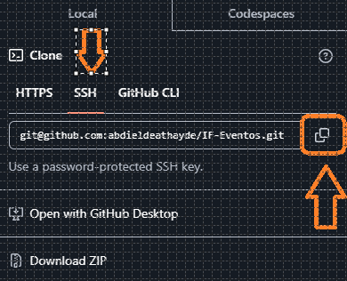

# IFSC-Eventos 

## Sistema para Eventos de Extensão do IFSC Campus Gaspar

O IFSC Eventos é um aplicativo desenvolvido para alunos e professores, oferecendo ferramentas para organizar a rotina de estudos. Com ele, é possível cadastrar usuários, gerenciar tarefas por meio de uma To-Do List e acompanhar o progresso com a porcentagem de conclusão de cada atividade. Além disso, o app permite login e a personalização do perfil com uma imagem de preferência do usuário.

### Tecnologias utilizadas:
- Java: foi escolhida essa linguagem por ter uma forte comunidade de desenvolvedores, mostrando que é uma linguagem muito utilizada nas áreas profissional e acadêmica.
- Swing: construção de layout e componentes para desktop
- IDE Eclipse: Ferramenta de desenvolvimento, permitindo desenvolver com Java e Swing
- Figma: Ferramenta de prototipagem para criar as telas da aplicação.
- MySQL: Sistema de Gerenciamento de Banco de Dados utilizado por já ter utilizado em projetos

### Baixar o Projeto do GitHub
 
- Para Clonar o projeto no Github existem algumas maneiras. A principal é clonando o repositório no GitHub via HTTPS

     

     

- Outra opção é baixando uma pasta com a extensão ".zip" contendo o projeto

     

- Ou você pode clonar o projeto via SSH

     

